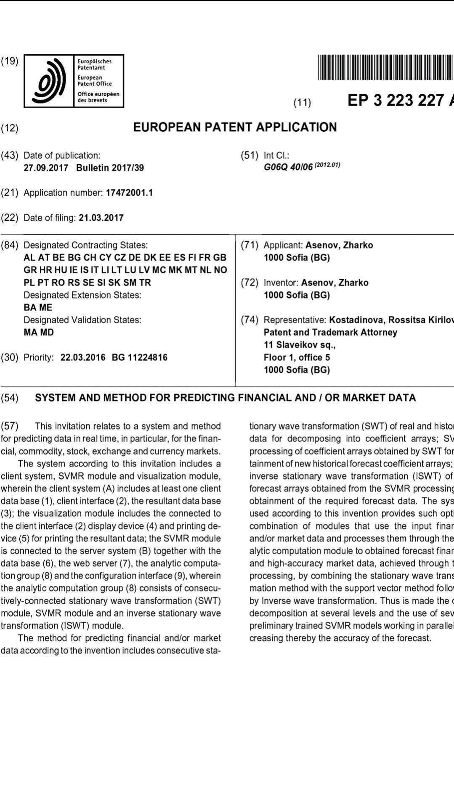

# About Tempus

Tempus is a project aimed at utilizing cutting edge methods to model time series and solve regression problems. In it's core Tempus uses an advanced SVM implementation that fixes several inconsistencies of the original theory by prof. Vapnik and Chervonenkis to achieve forecast precision better than any other algorithm currently available in the field of statistical learning. This is accomplished by calculating the ideal or reference kernel matrix for the provided labels and produce a kernel function fitted as tightly as possible to it - in order to extract all relevant information in the data. Having the ideal kernel matrix available for a dataset allows this SVM implementation to nest several support vector machines into each other as kernel functions, or have an another statistical model produce the kernel function (eg. gradient boosted trees using [LightGBM](https://github.com/microsoft/LightGBM) or a temporal fusion transformer using [Torch](https://pytorch.org/)). Several conventional kernel methods are also implemented as part of Tempus, such are a fast variant of the [Path Kernel (Baisero et al.)](https://www.scitepress.org/PublishedPapers/2013/42673/), the Radial-basis function, the [Global Alignment Kernel (Cuturi et al.)](https://marcocuturi.net/GA.html), etc.

For this implementation there is no need to tune the regularization cost parameter, epsilon thresholding or do tuning of kernel hyperparameters using a train-predict validation cycle. The model produced is optimal for the available data and hardware resources configured.

Beside nesting of kernel functions, three other methods of scaling (or ensembling) are provided; in the spectral domain using a modified online EMD and VMD, in the time domain or dynamic time slicing and sequential residuals or gradient boosting - the last one is work in progress. Each SVM model can have multiple internal weight layers - configured manually according to the complexity of the trained data. Weights are produced by a combination of a linear IRWLS solver with [MAGMA's GESV RBT](https://github.com/asenzz/magma) and a non-linear `(A+bT)x=b_m_` matrix optimizer - Pruned [BiteOpt](https://github.com/avaneev/biteopt) which is based on the CMA-ES algorithm, but interfaces to [PETSc](https://petsc.org/release), [MAGMA](https://github.com/icl-utk-edu/magma), [CUSolver](https://developer.nvidia.com/cusolver) and pruned [PRIMA](https://github.com/libprima) are also available.

Feature alignment and outlier filtering of the input data is implemented using the [BACON](https://www.intel.com/content/www/us/en/docs/onemkl/developer-reference-summary-statistics-notes/2021-1/using-the-bacon-algorithm-for-outlier-detection.html) algorithm, [HDBScan](https://github.com/ojmakhura/hdbscan) and simple Euclidean distance works good enough. This allows Tempus to efficiently model extremely noisy data. Feature selection is done by measuring normalized columns correlation to the labels trained.

An online learning mode is in the works.

Tempus is a project that unites researchers and engineers from several countries and academic institutions in order to exchange ideas, learn and achieve the best performance in time series analysis using the latest methods in statistics and signal processing. It makes use of HPC technologies such are OpenCL, OpenMP, CUDA and MPI to deliver optimal performance over highly parallel systems.

## File system

It consists of several libraries:

*   SVRDaemon - the executable that stays resident in memory and processes user requests
*   SVRBusiness - the service layer for managing domain model objects)
*   SVRPersist - the persistence layer for storing and reading persisted objects
*   SVRCommon - the common (shared) functionality accross modules
*   SVRModel - the domain model classes
*   lib - contains third party libraries and patches to them
*   SVRFix - the FIX protocol data connector
*   mql - contains MQL code for the MetaQuotes data connector
*   OnlineSVR - modeling algorithms are extension to the business layer
*   SVRWeb - an HTTP service, serving two roles: as MQL-over-JSON protocol data connector and presenting a Web user interface for monitoring and management
*   Each module is associated with its unit tests

To build the application create a build directory and run CMake pointing to the directory containing tempus-core/CMakeLists.txt eg. `cd ~/tempus-core; mkdir build; cd build ; ccmake ..` and choose the appropriate options. To run the app you need to configure PostgreSQL database, the connection string is configurable in **app.config**, and install the dependencies specified in doc/INSTALL. Note: Change the value of **SQL\_PROPERTIES\_LOCATION** app.config variable according to the location of PSQL files on your disk (default is SVRRoot/SVRPersist/postgres). Tempus can use a Postgresql database as data provider or DuckDB - an in-process columnar database with Postgresql like syntax. Choose DuckDB if a single Tempus process will be using the database and performance is important by setting the approprite CONNECTION\_STRING in app.config.

## History

The first implementation of Tempus started as a spin off of my University diploma work on the subject of scaling support vectors machine using the Wavelet transform in 2011. I pushlished the intial implementation as an open source project on sourceforge.net, main contributors being me and first employee Viktor. Later on I closed the project and secured financing from the Papakaya company in the order of 1.2 million euros, including my own means. This allowed me to hire many professional contributors and consult known experts on the subject, engineers and professors. The final goal being prediction of financial indexes or indicators. Tempus can, even with a modest GPU server (24 TFLOPS) produce positive forecast alpha when applied to the XAUUSD index. Thanks to everyone involved at the Bulgarian Academy of Sciences permitting access to their super computer, Ben Gurion University at Ber-Sheva for another computing server, students at FINKI Skopje and Taras Shevchenko University.

### Authors:

*   me - Lead programmer, design, testing, implementation and optimizing.
*   prof Emanouil Atanasov - Design and implementation of chunking MIMO SVR, IRWLS hybrid direct solver, Online VMD, fast Path kernel approximation, hyperparameter optimization, CUDA and OpenCL parallelization
*   Andrey Bezrukov - Project architecture and skeleton, optimization and parallelization
*   Evgeniy Marinov - Actually accurate Online SVR
*   Boyko Perfanov - SVR Epsilon and Cost path computation, (almost) boundless Wavelet decomposition à trous
*   Sergei Kondratiuk - SMO and Online SVR pilot implementation, cascaded SVM
*   Viktor Gjorgjievski - Initial project architecture design and implementation
*   Taras Maliarchuk - Infrastructure and project architecture
*   Guy Tal - Database and multithreading, optimization
*   Stilyan Stojanov - Implementation of the MIMO SVR, EVMD, kernels,
*   Petar Simov - SVR and epsilon SVR path, infrastructure
*   Dimitar Conov - GA kernel
*   Stanislav Georgiev - Online SMO SVR, Wavelet decomposition
*   Dimitar Slavchev - OpenCL kernels
*   Vladimir Hizanov - Parameter tuning

Thanks to:

*   Angel Pavlov - designed the Tempus logo
*   Kristina Eskenazi - PR and connections
*   Petar Ivanov - Web interface code
*   George Kour - ML consulting
*   prof Jihad El-Sana - Advice and support
*   prof Dejan Gjorgjevik - Consultancy and support, referring students at FINKI Skopje
*   prof William Cohen - for the ADA boost code
*   Oleg Gumbar, Milen Hristov, Aleksandar Miladinov, Ali Kasmou - Sysadmins in Papakaya
*   Vasil Savuliak - for referring people to the office in Kiev

## European patent application 17472001.1

 Patent 17472001.1 is covering a scalable support vector regression service using wavelet decomposition of financial index data on the territory of European continent.

## BSD 4-Clause License

Copyright (c) 2025, Žarko Asen

Redistribution and use in source and binary forms, with or without modification, are permitted provided that the following conditions are met:

1\. Redistributions of source code must retain the above copyright notice, this list of conditions and the following disclaimer.

2\. Redistributions in binary form must reproduce the above copyright notice, this list of conditions and the following disclaimer in the documentation and/or other materials provided with the distribution.

3\. All advertising materials mentioning features or use of this software must display the following acknowledgement:

This product includes software developed by the Tempus project.

4\. Neither the name of the copyright holder nor the names the copyright holder nor the names of its contributors may be used to endorse or promote products derived from this software without specific prior written permission.

THIS SOFTWARE IS PROVIDED BY COPYRIGHT HOLDER "AS IS" AND ANY EXPRESS OR IMPLIED WARRANTIES, INCLUDING, BUT NOT LIMITED TO, THE IMPLIED WARRANTIES OF MERCHANTABILITY AND FITNESS FOR A PARTICULAR PURPOSE ARE DISCLAIMED. IN NO EVENT SHALL THE TEMPUS PROJECT BE LIABLE FOR ANY DIRECT, INDIRECT, INCIDENTAL, SPECIAL, EXEMPLARY, OR CONSEQUENTIAL DAMAGES (INCLUDING, BUT NOT LIMITED TO, PROCUREMENT OF SUBSTITUTE GOODS OR SERVICES; LOSS OF USE, DATA, OR PROFITS; OR BUSINESS INTERRUPTION) HOWEVER CAUSED AND ON ANY THEORY OF LIABILITY, WHETHER IN CONTRACT, STRICT LIABILITY, OR TORT (INCLUDING NEGLIGENCE OR OTHERWISE) ARISING IN ANY WAY OUT OF THE USE OF THIS SOFTWARE, EVEN IF ADVISED OF THE POSSIBILITY OF SUCH DAMAGE.
